

  <picture>
    <source media="(prefers-color-scheme: dark)" srcset="./src/assets/brand/LOXT-lockup-white.svg">
    <source media="(prefers-color-scheme: light)" srcset="./src/assets/brand/LOXT-lockup-charcoal.svg">
    
  </picture>

  <h1>LOXT</h1>
  
<strong>Local Speech-to-Text powered by your own hardware.</strong>

  
녹음하고, 변환하고, 메모하세요. 기록은 내 PC에.

  
  

  

    <a href="https://github.com/threetrue03/loxt/releases/download/v2.6.0/LOXT-Setup-2.6.0-x64.exe"><strong>Windows 다운로드 · v2.6.0</strong></a> ·
    <a href="https://loxt.pages.dev/">소개 사이트</a> ·
    <a href="https://github.com/threetrue03/loxt/releases">릴리스 안내</a> ·
    <a href="https://github.com/threetrue03/loxt/issues">문의 · 버그 신고</a>
  

---

LOXT는 내 컴퓨터의 하드웨어로 음성을 스크립트로 변환하는 Windows 앱입니다. 회의와 강의, 인터뷰를 기록하고 원본을 다시 들으며 내용을 정리하세요. 녹음 옆에 메모를 남기거나, 녹음 없이 독립 문서를 작성할 수도 있습니다.

이 페이지에서는 제품 기능, 사용 방법과 설치 파일을 안내합니다. 버전별 다운로드와 변경 사항은 [Releases](https://github.com/threetrue03/loxt/releases)에서 확인하세요.

## 미리 보기

<picture>
  <source media="(prefers-color-scheme: dark)" srcset="./docs/assets/workspace-dark.png">
  <source media="(prefers-color-scheme: light)" srcset="./docs/assets/workspace-light.png">
  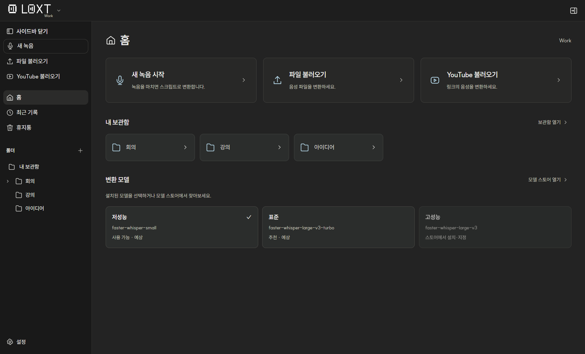
</picture>

*2.6.0 실제 앱 화면입니다. 녹음·스크립트·메모는 소개용 예시이며 변환 정확도나 속도의 측정 결과가 아닙니다.*

## Work와 Live

| 작업 공간 | 이런 때 사용하세요 |
| --- | --- |
| **Work** | 녹음을 마친 뒤 변환하거나 기존 음성 파일을 정리할 때. 스크립트 옆에 메모를 남기거나 독립 문서를 작성할 때. |
| **Live** | 대화가 진행되는 동안 스크립트를 계속 확인하고 싶을 때. 일시정지·재개 후 기록을 마칠 때. |

상단 로고 옆 메뉴에서 작업 공간을 바꿀 수 있습니다. 기록과 폴더는 각 공간에서 따로 관리하고, 설치한 모델과 화면 테마는 함께 사용합니다.

## 새 탭과 보관함

상단 오른쪽 **패널 열기 아이콘**을 누르면 브라우저 또는 LOXT 폴더를 여는 패널이 나타납니다. 기존 탭을 다시 열며, 패널 안의 **+** 또는 **Ctrl+T**로 여러 탭을 만들고 나란히 기록을 확인하거나 웹페이지를 열 수 있습니다. 탭마다 경로·검색·열린 기록을 유지하며 패널을 접어도 녹음과 변환은 이어집니다.

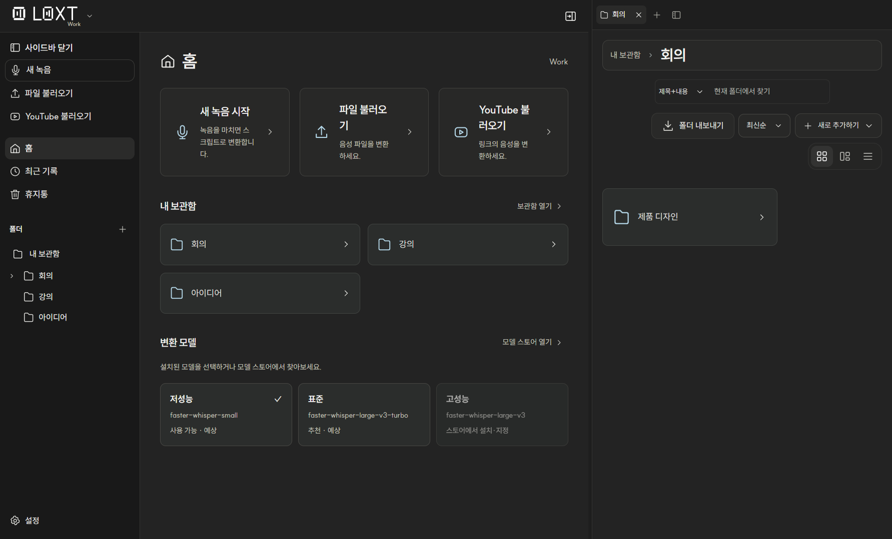

브라우저는 LOXT 전용 저장 공간을 사용합니다. 기존 Chrome 계정과 자동 동기화하지 않으며 로그인 유지는 각 사이트 정책에 따라 달라집니다. **1.14.0 일반 실행 환경에서 ChatGPT 로그인·메시지 응답·앱 재시작 후 로그인 유지까지 확인했습니다.** 사용자가 Google 이메일 계정으로 직접 로그인하고 응답을 확인한 결과입니다. 다른 계정 방식과 환경을 모두 검증한 것은 아닙니다. [검증 기록](./docs/chatgpt-compatibility-1.14.0.md)

현재 보관함에서 제목·내용 검색과 **Ctrl+F**, 전체 선택 **Ctrl+A**, 삭제 확인 **Delete**, 이동·휴지통 이동 실행 취소 **Ctrl+Z**, 다시 실행 **Ctrl+Shift+Z**를 지원합니다. 실행 취소 이력은 현재 실행 세션에만 유지됩니다. **Ctrl+1~9**는 오른쪽 탭으로 이동하며 **Ctrl+W**는 선택한 오른쪽 탭을 닫습니다. 메모 편집기의 선택·실행 취소 단축키는 문서 편집에 적용됩니다.

설정 → 저장 공간에서 보관함 위치를 변경하면 Work·Live 녹음·메모·PDF·그리기·첨부파일을 복사·검증하고 새 위치로 전환합니다. 원래 파일은 보존되며 설치된 모델은 이동하지 않습니다. 기본 기록 위치는 `%APPDATA%/LOXT/work-library`와 `%APPDATA%/LOXT/live-library`입니다. 호환성을 위해 앱 설정과 모델의 기존 저장 경로·식별자는 유지합니다.

## 주요 기능

| 기능 | 할 수 있는 일 |
| --- | --- |
| **내 하드웨어로 변환** | 지원하는 NVIDIA GPU 또는 CPU를 자동으로 선택해 로컬에서 음성을 처리합니다. |
| **녹음과 파일 가져오기** | 마이크·컴퓨터 소리를 녹음하거나 기존 음성 파일을 불러옵니다. |
| **YouTube 불러오기** | 공개된 일반 영상 링크에서 음성을 가져와 Work에서 변환합니다. |
| **Live 화자 표시** | Live 안의 목소리를 화자 1·2·3로 표시합니다. 새 Work 변환은 화자 분석을 실행하지 않으며 기존 저장된 표시는 보존합니다. |
| **폴더 내보내기** | 현재 폴더와 하위 기록을 ZIP으로 내보냅니다. 원본 음성·스크립트 TXT·메모 Markdown·참조된 첨부파일·PDF 원본·필기 JSON을 포함합니다. |
| **원본과 스크립트** | 문장을 누르면 해당 시간으로 재생 위치가 이동합니다. 전체 복사·TXT·PDF 내보내기·다시 변환하기를 지원합니다. |
| **녹음 옆 메모** | 스크립트 오른쪽에서 메모를 열고 원본을 들으며 작성합니다. 다시 변환해도 메모는 유지됩니다. |
| **독립 메모** | 녹음 없이 문서를 만들고 Markdown 입력과 블록 편집을 사용합니다. |
| **문서 편집** | 제목·목록·체크·토글·표·코드·수식·이미지·파일, 텍스트 서식과 문서 검색을 지원합니다. |
| **메모 저장·내보내기** | 자동 저장과 저장 실패 후 재시도, Markdown·HTML·PDF 내보내기를 제공합니다. |
| **보관함** | 중첩 폴더·이름 변경·경로 이동·여러 기록 선택·드래그 이동·휴지통 복구와 비우기를 지원합니다. |
| **변환 대기열** | 다른 페이지로 이동해도 변환을 유지하고 작업별 상태 확인·취소를 제공합니다. |
| **화면과 설정** | SUIT 글꼴, 다크·라이트 테마, 카드·작은 카드·목록 보기와 Work·Live별 기본 모델·입력 장치를 제공합니다. |

## 2.6.0 — 모델 스토어와 내 PC 성능 확인

- 홈에서 현재 모드의 **저성능·표준·고성능** 모델을 선택하고 **모델 스토어 열기**로 이동합니다.
- Hugging Face의 공개 음성 인식 모델을 검색하고 **전체 / Work / Live / 한국어 / 설치됨**으로 구분합니다. 상세에서 실제 이름·제공처·언어·용량·라이선스·지원 상태를 확인합니다.
- 현재 설치 대상은 호환되는 **CTranslate2 Whisper** 모델입니다. 다른 엔진의 모델은 지원 예정으로 표시합니다. 다운로드를 고정 버전으로 받고 해시와 실제 모델 로딩을 확인합니다.
- 역할과 기본 모델은 **Work·Live에서 따로 지정**합니다. **별명·태그**는 모델에 함께 저장합니다. 미지정 모델은 기타 모델, 직접 가져온 모델은 외부 모델로 구분합니다.
- **성능 확인**은 Windows 예시 음성의 모델 로딩·파일 RTF·2초/6초 청크 처리 시간을 측정합니다. 예상과 실측을 구분하며 정확도나 전체 Live 지연을 측정한 수치로 소개하지 않습니다.
- 설치 취소 후 이어받기, 실패한 업데이트의 기존 모델 보존과 중단된 설치 복구를 지원합니다. 새 버전은 상세에서 확인해 직접 설치하며 자동 업데이트하지 않습니다.
- 목록은 24시간, 검색은 15분 캐시합니다. 네트워크 오류를 안내하며 **새로고침**으로 다시 확인합니다. 웹에서 목록·검색·상세를 볼 수 있고 관리는 PC 앱에서 합니다.

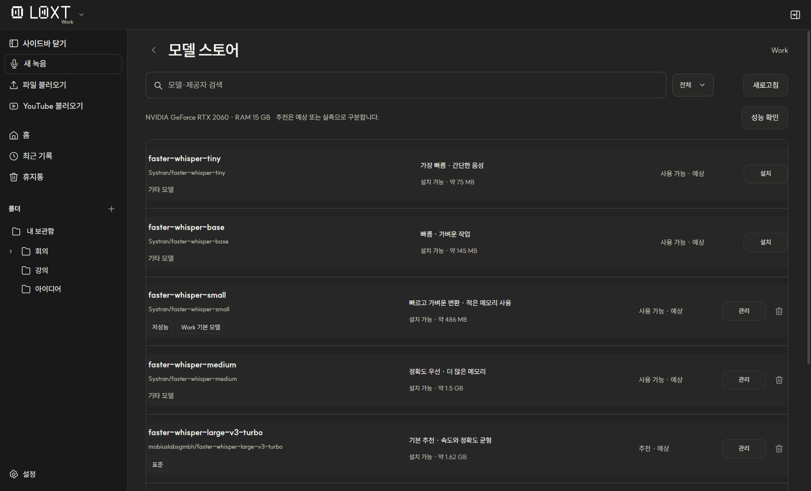

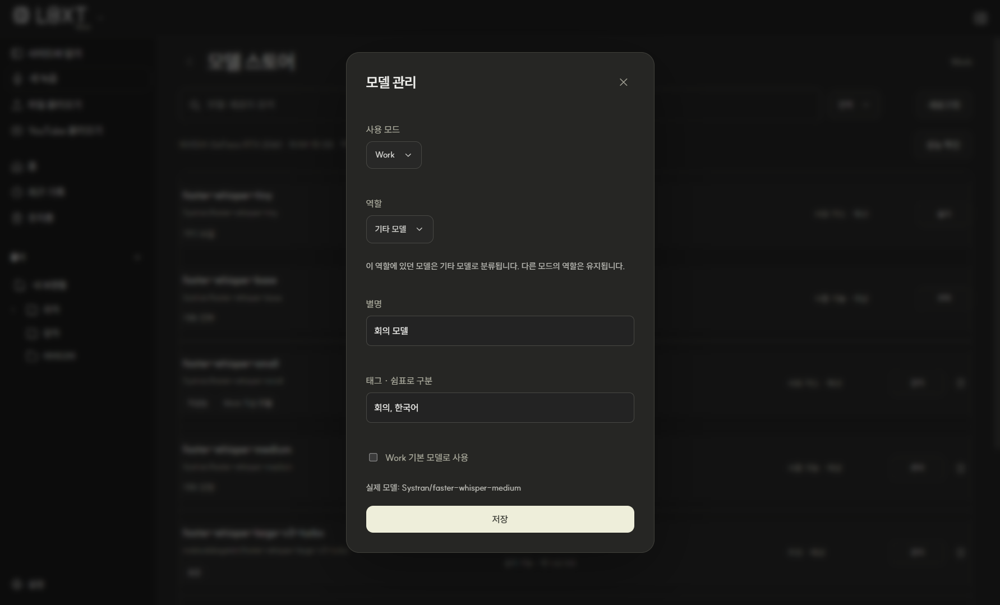

[구현·실제 측정과 검증 범위](./docs/implementation-2.6.0.md) · [릴리스 문구](./docs/release-2.6.0.md)

## 2.5.0 — 보관함·문서·그리기 관리

- 사이드바는 내 보관함 바로 아래 폴더를 먼저 보여주고 하위 폴더는 접어 둡니다. **Ctrl+Shift+S**로 열고 닫으며 홈·최근 기록·휴지통 제목에도 아이콘을 표시합니다.
- 새로 추가하기를 **폴더 / 새 녹음·새 메모·새 그리기 / 녹음·YouTube·PDF 불러오기**로 나눴습니다. 녹음 중에는 새 녹음 시작을 막고 현재 녹음으로 돌아갑니다.
- 선택한 항목에서 우클릭하면 **선택한 N개 항목**을 함께 이동하거나 휴지통으로 보냅니다. 선택하지 않은 항목의 메뉴는 그 항목 하나에 적용됩니다.
- 녹음·스크립트의 저장 상태, 편집 가능한 제목·경로·날짜를 문서 도구 모음에 모았습니다. 스크립트와 연결 메모는 **같은 문서 전체화면**을 사용합니다.
- 새 그리기는 페이지 패널의 **+**로 페이지를 추가하고, **… 또는 길게 누르기**로 복제·삭제합니다. 삭제는 실행 취소할 수 있고 복제한 필기는 페이지와 함께 저장됩니다. 불러온 PDF의 페이지 편집은 제공하지 않습니다.
- **녹음 지우기**는 원본만 별도 휴지통 항목으로 이동합니다. 스크립트·메모를 유지하고 복원하면 원래 기록에 다시 연결합니다. 원본 영구 삭제 전까지 저장 공간은 그대로 사용합니다. 영구 삭제 후에는 원본 재생·다시 변환이 불가능합니다.

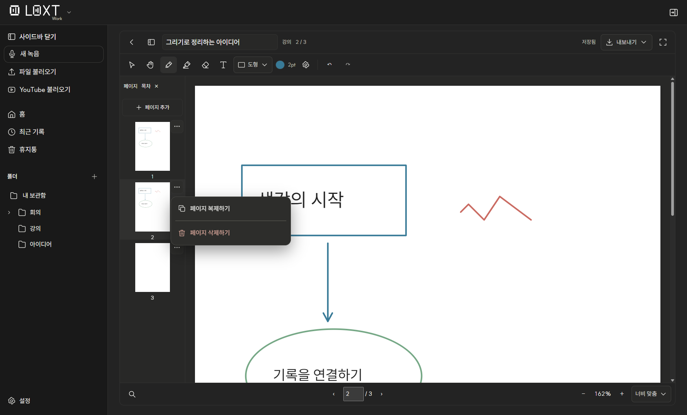

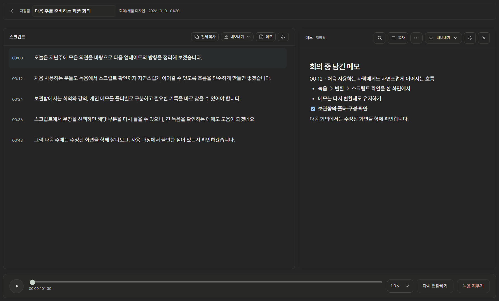

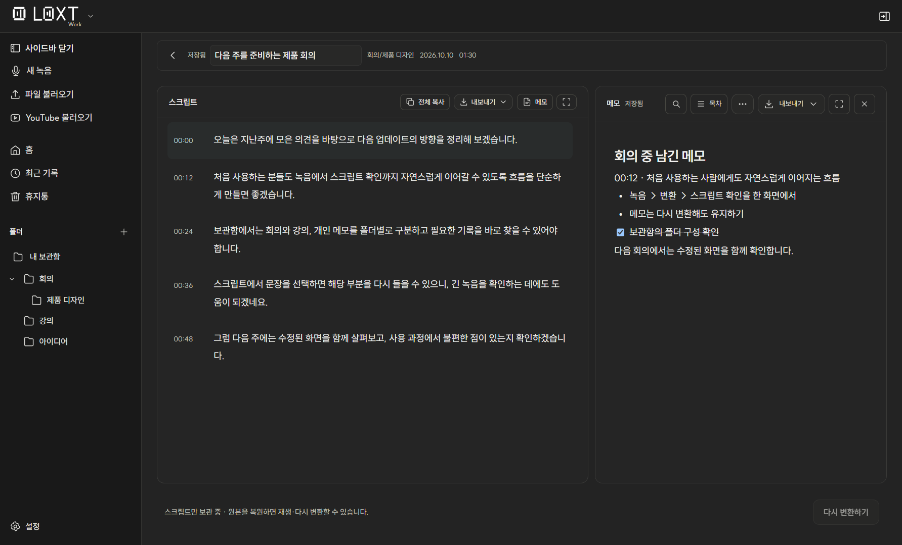

[2.5.0 릴리스 안내](./docs/release-2.5.0.md)

## 2.4.0 — 기기 간 변경분 동기화

- 메모는 변경 블록·순서, PDF·그리기는 변경 객체만 전송합니다. 저장 응답은 버전만 반환하고 다른 화면도 변경분을 조회합니다.
- 필기 중에는 임시 미리보기를 표시합니다. 저장된 필기와 구분하며 취소·연결 해제·시간 만료 시 제거합니다.
- 여러 웹 탭의 이벤트와 JSON 요청은 인증된 WebSocket을 사용합니다. 파일 업로드·다운로드는 HTTPS를 유지합니다.
- 짧게 묶어 저장하며 변경 기록을 디스크에 동기화한 뒤 완료를 알립니다. 저장 기록은 재실행 시 복구하고 일정 크기마다 문서 사본으로 정리합니다.
- 저장·편집 중 받은 변경은 버전을 기억해 다시 확인합니다. 동시 편집 충돌 시 현재 초안을 보존합니다.
- 일반 메모 갱신은 바뀐 블록만 적용하며, 구조가 바뀌면 문서를 다시 적용합니다.
- PC 설정 → 내 기기 연결 → 동기화 진단, 웹의 PC 연결됨에서 요청 시간·연결 상태를 확인하거나 진단을 복사할 수 있습니다.

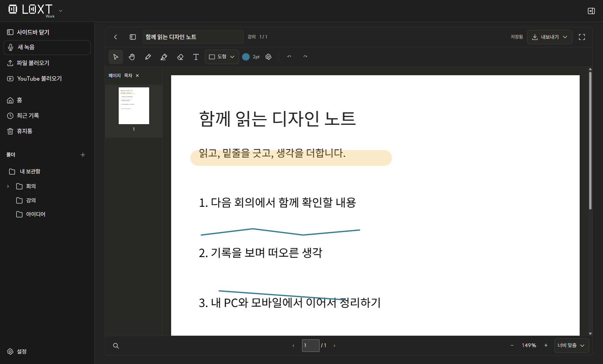

실제 반영 시간은 Wi-Fi와 PC 상태에 따라 달라집니다. 동일 PC의 별도 예시 프로필 검증과 실제 iPad의 Wi-Fi 검증은 구분합니다. [구현·검증 기록](./docs/implementation-2.4.0.md)

## 2.3.0 — 그리기와 문서 집중 화면

- Work·Live 보관함의 **새로 추가하기 → 그리기**에서 빈 A4 문서를 만듭니다. 펜·형광펜·지우개·텍스트·도형과 자동 저장, 필기 포함 PDF 내보내기를 사용합니다.
- PDF·그리기는 뒤로 가기·페이지 패널·편집 가능한 이름·경로·페이지 수를 위에 모으고, **저장됨 → 내보내기 → 전체화면**으로 배치했습니다. 메모에도 뒤로 가기와 이름·경로·날짜, 내보내기 옆 전체화면을 제공합니다.
- 메모의 옆 블록 메뉴를 제거했습니다. Markdown 입력, `/` 메뉴와 선택한 텍스트 서식은 유지합니다.
- 핀치 중에는 기존 페이지와 필기를 함께 확대하고, 손을 뗀 뒤 최종 배율로 다시 그립니다. 모바일 페이지 캔버스는 약 5MP로 제한하고 페이지 미리보기를 가상화했습니다.
- 원격에서 32MB 이상 PDF를 열면 PC의 별도 작업자가 필요한 페이지를 렌더합니다. 모바일에 원본 전체를 보내지 않습니다. 전체 텍스트 색인은 검색할 때 PC에서 준비해 재사용합니다. 큰 배율에서는 전체 페이지 픽셀 제한 때문에 선명도가 제한될 수 있습니다.
- 모바일 하단 탐색은 **홈·보관함·설정**으로 정리했습니다. 홈 화면에 추가할 때 LOXT 전용 아이콘을 사용하며 웹 화면 자체의 제스처 확대는 제한합니다.

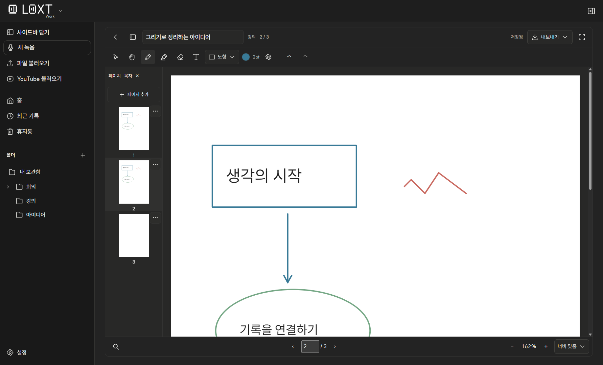

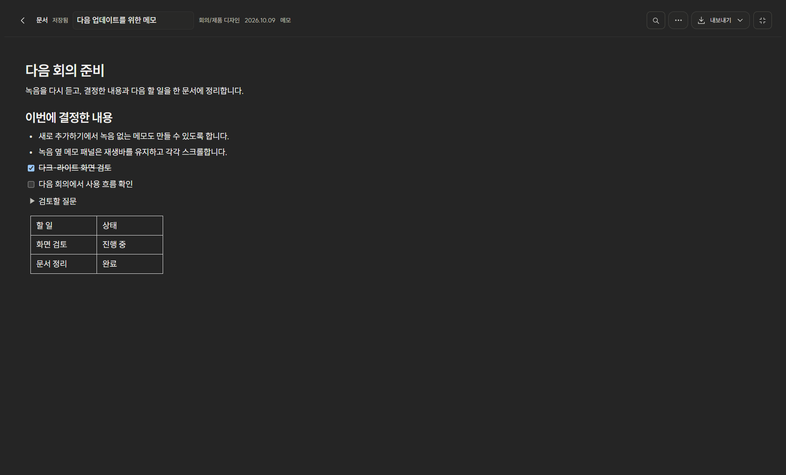

## 2.2.0 — 빠른 동기화와 PDF 필기 개선

- 메모·필기를 문서별로 저장하고 변경된 문서만 갱신합니다. 목록은 짧은 미리보기로 받아오고 전체 스크립트는 열거나 더 볼 때 읽습니다.
- 연속 필기 중에도 일정 간격으로 저장하며, 저장 대기·PC 저장 중·기기에 초안 보관 상태를 구분합니다. 앱 종료 시 메모와 PDF 저장을 함께 확인합니다.
- 다른 기기에서 바꾼 제목을 화면에 반영하고, 오래된 이름으로 새 제목을 덮어쓰지 않습니다. 실제 편집한 경우에만 저장합니다.
- PDF 영역에서 두 손가락으로 확대·이동합니다. 펜 필기와 손가락 이동을 구분하며 **필기 옵션 → 손가락 필기**로 휴대폰에서도 직접 쓸 수 있습니다. 웹 앱과 소개 사이트의 제스처 확대를 제한하며, PDF·그리기 내부 확대는 유지합니다.
- 점·드래그 지우기·이동 도구와 Space 임시 이동, 도구별 색상·굵기, 선택한 객체 속성과 텍스트 크기, 검색 결과 강조·이전/다음 결과, 안전한 PDF 링크와 목차를 지원합니다.
- 화면 폭에 따른 PDF 맞춤, 페이지·확대·스크롤 보기 복원, 모바일 도구 모음과 작은 내보내기를 적용했습니다. 보기 전용 용지 톤은 원본·내보내기에 영향을 주지 않습니다.
- 원격 요청의 대기 시간을 제한하고 재접속 후 상태를 갱신합니다. 미완료 모바일 녹음 조각을 개별 저장해 전체 녹음을 반복 복사하지 않습니다.

기존 연결 주소 재입력, 모바일 하단 탐색과 PC 승인·인증서 절차는 유지됩니다. 이번 자동 검증은 Electron·Edge·WebKit의 별도 예시 프로필 기준이며, 실제 iPad/iPhone 핀치와 Apple Pencil은 추가 실기기 확인이 필요합니다.

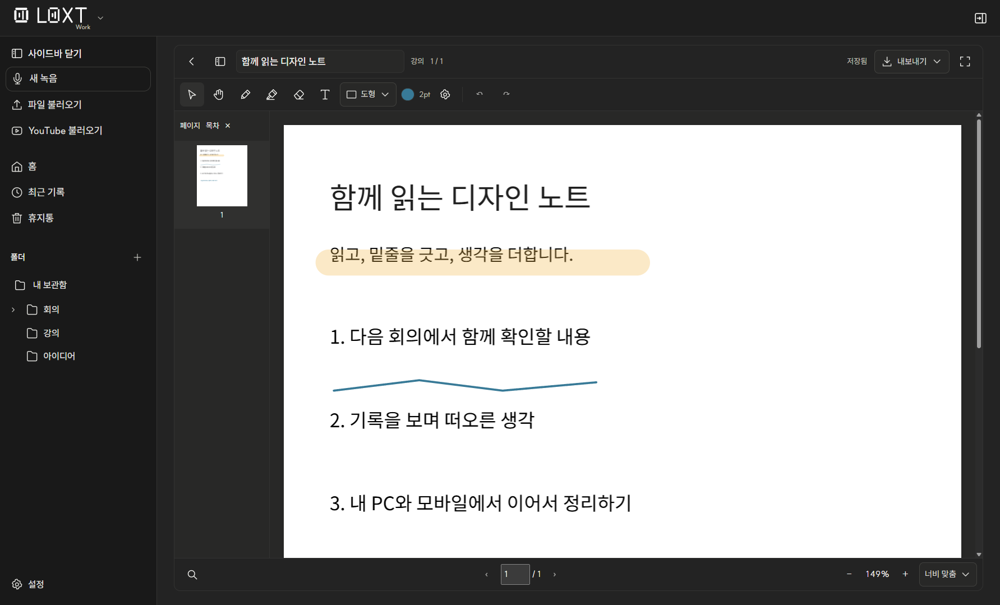

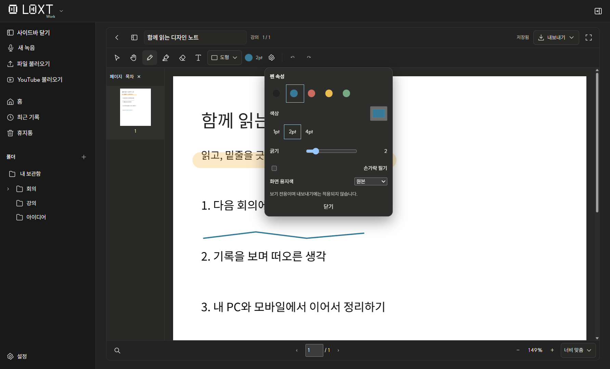

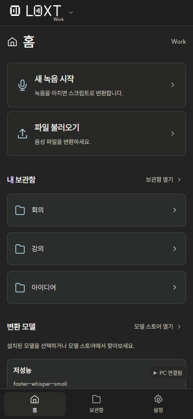

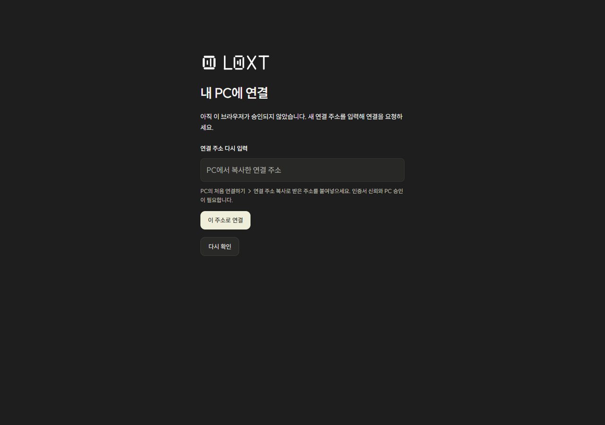

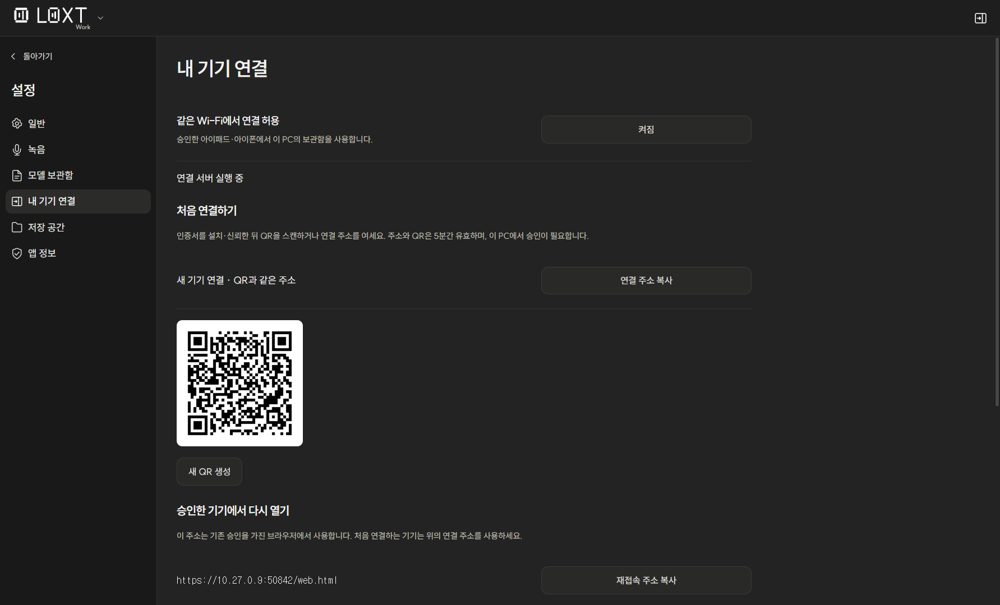

## PDF와 모바일

Work·Live 폴더에서 **새로 추가하기 → PDF 불러오기** 또는 **새 그리기**를 사용하세요. 그리기는 빈 A4 한 페이지로 시작하는 독립 문서입니다. 원본 PDF는 변경하지 않고 필기를 별도로 저장합니다. 파일은 최대 **128 MB**, 암호화 PDF는 해제 사본이 필요하며 스캔 문서 OCR은 지원하지 않습니다. 단축키는 **T** 텍스트, **Ctrl+D** 도형, **Ctrl+Shift+E** 펜·지우개 전환, **Ctrl+Shift+H** 형광펜입니다. **Ctrl+D** 뒤 **1·2·3·4**로 직선·화살표·사각형·타원을 선택합니다. **Space 누른 채 드래그** 문서 이동, **Ctrl+Z / Ctrl+Shift+Z** 실행 취소·다시 실행, **Delete** 선택한 필기 삭제, **Esc** 선택 도구, **Ctrl+F** PDF 검색을 지원합니다. 도구에 마우스를 올려 단축키를 확인하세요.

모바일 연결은 기본적으로 꺼져 있습니다. PC **설정 → 내 기기 연결**에서 켜고 같은 Wi-Fi에서 인증서를 설치·신뢰한 다음 QR 또는 처음 연결하기의 연결 주소로 접속해 PC에서 승인하세요. 승인한 기기는 동일한 보관함과 PC 설치 모델을 사용합니다. PC가 켜져 있어야 하며 개인 네트워크 방화벽 연결 허용이 필요할 수 있습니다. 인터넷에 공개하는 서버나 운영자의 공용 계정 서비스는 아닙니다.

모바일 신규 Live 녹음·컴퓨터 소리·내장 브라우저·모델 관리·PC 파일 경로 접근은 제공하지 않습니다. 모바일 Work 마이크 녹음은 Safari가 열린 **전경 사용** 기준입니다. 잠금·다른 앱 전환 중 지속을 보장하지 않습니다. 미완료 음성은 기기 임시 저장소에서 원본 받기/PC 복구 사본 저장을 제공하지만 저장 공간 제한과 브라우저 데이터 삭제의 영향을 받습니다. 변환에는 PC의 GPU 또는 CPU를 사용하며 최초 실행 환경 준비에는 추가 다운로드와 시간이 필요할 수 있습니다.

iPhone Safari에서 PDF 필기 저장·메모 수정·마이크 녹음·PC CUDA 변환·네 모델 표시·스크립트와 원본 재생을 사용자가 확인했습니다. iPad Pencil·외장 키보드와 모든 OS/기기 조합을 검증한 것은 아닙니다.

## 새 탭과 녹음 메모

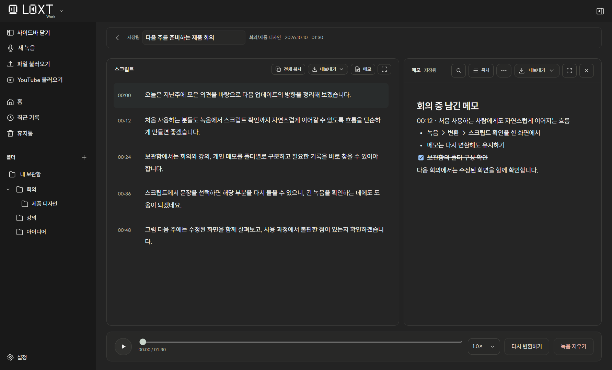

**녹음과 함께 쓰는 메모**

변환이 끝난 Work·Live 기록에서 **내보내기 오른쪽 → 메모**를 누르세요. Work·Live 녹음 중에도 스크립트 오른쪽의 메모 버튼을 사용할 수 있습니다. Work에서는 녹음을 시작하면 메모 버튼이 활성화됩니다. 스크립트와 메모 사이를 드래그해 폭을 조절할 수 있습니다. 각각 스크롤하고 하단 재생바는 유지됩니다. 패널을 닫거나 다른 페이지로 이동한 뒤에도 작성 내용을 이어갈 수 있습니다.

**녹음 없는 독립 문서**

Work·Live 보관함에서 **새로 추가하기 → 새 메모**를 선택하세요. 제목을 그 자리에서 수정하고 녹음과 같은 폴더·카드·목록·최근 기록·휴지통에서 관리합니다.

**익숙한 방식으로 편집**

Markdown을 입력하거나 **/** 메뉴에서 블록을 검색하세요. 텍스트를 선택해 서식을 적용하고 텍스트 서식과 Markdown 입력을 사용합니다. 불필요한 블록 옆 관리 메뉴는 표시하지 않습니다. 메모는 자동 저장되며 Markdown·HTML·PDF로 내보냅니다.

첨부파일은 하나당 최대 **32 MB**입니다. Markdown은 색상·밑줄·토글 등 일부 서식을 단순화합니다. HTML·Markdown과 함께 생성된 첨부파일 폴더는 문서와 함께 보관하세요. 모바일 내보내기에서는 이 파일들을 ZIP으로 묶습니다. PDF에는 첨부파일 원본을 넣지 않습니다.

## 다운로드와 설치

1. [Releases](https://github.com/threetrue03/loxt/releases)에서 원하는 버전의 **LOXT-Setup-〈버전〉-x64.exe**를 다운로드합니다.
2. 설치 프로그램에서 사용할 모델을 선택합니다. 여러 모델을 선택하거나 앱에서 나중에 설치할 수 있습니다.
3. 선택한 모델과 실행 환경을 준비하고 LOXT를 실행합니다. 준비를 건너뛴 경우 첫 사용 시 필요한 구성요소를 준비합니다.

업데이트할 때도 새 설치 파일을 실행하세요. 기존 녹음·스크립트·메모·폴더·모델·설정과 저장 위치를 유지합니다. 공개된 설치 파일의 최신 버전은 Releases에서 확인하세요.

### 실행 환경

- 현재 배포 대상은 **Windows x64**입니다.
- NVIDIA GPU 가속에는 호환되는 GPU와 드라이버가 필요합니다. GPU 드라이버는 별도로 설치해야 합니다.
- 지원하는 NVIDIA GPU가 없으면 CPU를 사용합니다. AMD GPU는 현재 CUDA 추론 대상으로 지원하지 않습니다.
- 모델 다운로드와 최초 환경 준비에는 인터넷 연결 및 추가 저장 공간이 필요합니다.
- 변환 속도·Live 갱신 지연·사용 메모리는 모델, 음성 내용과 하드웨어에 따라 달라집니다.

## 시작하기

### Work — 녹음이나 파일 변환

1. **새 녹음**에서 제목과 입력 장치를 선택하고 녹음을 시작합니다. 기존 파일은 **파일 불러오기**를 사용하세요.
2. 잠시 멈추려면 **일시정지**, 이어서 녹음하려면 **녹음 계속**을 사용합니다. **녹음 중단**은 원본을 저장하고 **버리기·변환하기** 버튼으로 전환합니다.
3. **변환하기** 버튼으로 폴더·모델 선택 창을 열고, 선택 창에서 **변환하기**를 누르면 저장 후 변환을 시작합니다. 완료된 스크립트에서 문장을 눌러 원본을 듣거나 복사·내보내기를 사용합니다.
4. 필요한 내용은 옆 메모에 적고 폴더에 정리하세요.

YouTube 불러오기는 공개된 일반 영상 링크를 대상으로 합니다. Shorts·재생목록·실시간 방송·비공개·로그인이 필요한 영상은 지원하지 않습니다. 다운로드할 권한이 있는 콘텐츠에 사용하세요.

### Live — 대화하면서 확인

1. 로고 옆 메뉴에서 **Live**로 이동합니다.
2. 하단에서 모델과 입력 장치를 선택하고 **Live 시작**을 누릅니다.
3. 필요한 입력 권한과 모델 준비를 마치면 자동으로 녹음을 시작합니다. 준비 중에는 녹음하지 않습니다.
4. 필요하면 일시정지·재개하고 **Live 종료**로 기록을 마칩니다.

화자 표시는 사람의 실명을 알아내는 기능이 아닙니다. 짧은 발화·잡음·겹치는 목소리에서는 구분이 달라질 수 있으며, Live의 임시 표시는 종료 후 분석 결과에 따라 보정될 수 있습니다.

## 모델 선택

| 앱 표시 | 모델 | 다운로드 크기 | 선택 기준 |
| --- | --- | --- | --- |
| **저성능** | small | 약 486 MB | 가볍게 사용 |
| **표준** | large-v3-turbo | 약 1.62 GB | 속도와 정확도 균형 |
| **고성능** | large-v3 | 약 3.09 GB | 정확도 우선 |

위 표는 최초 역할의 기본 모델입니다. 설정 → 모델 보관함에서 각 역할을 다른 설치 모델로 바꿀 수 있습니다. tiny·base·medium도 스토어에서 설치하며 별명·태그로 관리합니다. 모델마다 원 제공처의 라이선스가 적용됩니다.

표시 용량은 모델 다운로드 크기입니다. GPU 메모리 요구량이나 전체 설치 용량을 뜻하지 않으며 실행 환경은 추가 공간을 사용합니다. 모델 보관함에서 설치·삭제·기본 모델 선택과 호환되는 외부 모델 불러오기를 관리하세요.

## 기록과 개인정보

녹음·스크립트·메모·PDF·폴더는 사용자 PC에 저장됩니다. 기기 연결을 켜면 PC에서 승인한 모바일 기기가 로컬 HTTPS를 통해 같은 보관함에 접근합니다. 준비된 모델로 로컬 음성 인식과 화자 분석을 실행하며 클라우드 음성 인식 서비스로 녹음을 업로드하지 않습니다.

모델 스토어 검색·상세 조회는 Hugging Face에 검색어와 모델 이름을 요청합니다. 녹음 내용은 보내지 않습니다. 모델·실행 구성요소 다운로드와 YouTube 불러오기는 인터넷에 접속합니다. 설정의 **저장 공간**에서 저장 위치와 사용량을 확인하고, **일반**에서 다크·라이트 테마를 선택할 수 있습니다.

저장 실패가 표시되면 메모에서 다시 시도하세요. 미저장 내용은 앱 메모리에 유지되지만 강제 종료나 정전 직전의 입력까지 보장하지는 않습니다. 휴지통에서 영구 삭제한 기록은 복구할 수 없습니다.

## 문의와 변경 사항

- 버전별 설치 파일·변경 사항: [Releases](https://github.com/threetrue03/loxt/releases)
- 제품 소개: [loxt.pages.dev](https://loxt.pages.dev/)
- 문의·버그 신고: [Issues](https://github.com/threetrue03/loxt/issues)

버그 신고에는 앱 버전, Windows 버전, 선택한 모델과 재현 방법을 적어주세요. 녹음과 로그를 공유할 때는 개인정보를 먼저 확인하세요.

## 저작권과 외부 구성요소

Copyright (c) 2026 threetrue03. LOXT 이름과 로고는 LOXT의 브랜드 자산입니다.

음성·화자 모델, 편집기, 글꼴과 실행 도구의 권리는 각 저작권자에게 있으며 해당 구성요소의 라이선스가 적용됩니다. [모델 출처·라이선스](./docs/MODEL-LICENSES.md)와 [제3자 고지](./build/THIRD-PARTY-NOTICES.md)를 확인하세요. 이 제품 소개 문서는 기존 자료나 외부 구성요소의 라이선스를 변경하지 않습니다.
