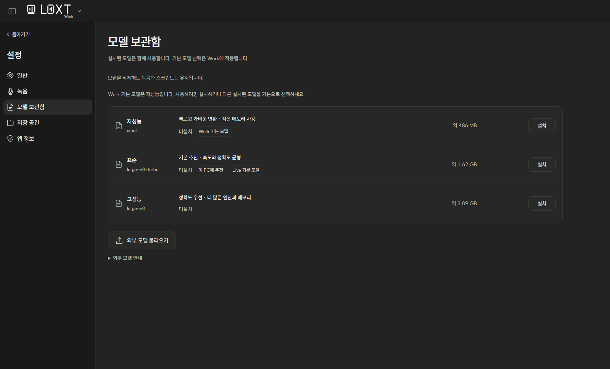

<div align="center">
  <picture>
    <source media="(prefers-color-scheme: dark)" srcset="./src/assets/brand/LOXT-lockup-white.svg">
    <source media="(prefers-color-scheme: light)" srcset="./src/assets/brand/LOXT-lockup-charcoal.svg">
    
  </picture>

  <h1>LOXT</h1>
  <p><strong>Local Speech-to-Text powered by your own hardware.</strong></p>
  <p>내 컴퓨터에서 녹음하고, 변환하고, 정리하는 로컬 음성 기록 앱.</p>

  <a href="./LICENSE"></a>
  
  

  <p>
    <a href="https://github.com/threetrue03/loxt/releases"><strong>Windows 다운로드</strong></a> ·
    <a href="https://loxt.pages.dev/">소개 사이트</a> ·
    <a href="https://github.com/threetrue03/loxt/issues">버그 신고 · 기능 제안</a>
  </p>
</div>

---

LOXT는 Whisper 기반 음성 인식을 내 PC에서 실행하는 Windows 데스크톱 앱입니다. **Work**에서는 녹음이나 파일을 스크립트로 변환하고, **Live**에서는 녹음 중 스크립트를 계속 추가합니다. 두 작업 공간의 기록을 따로 관리하면서 모델은 함께 사용할 수 있습니다.

NVIDIA GPU가 있으면 CUDA로 변환하고, 지원하는 GPU가 없는 환경에서는 CPU를 사용합니다. 로컬 녹음과 스크립트를 클라우드 음성 인식 서비스에 업로드하지 않습니다.

## 미리 보기

<picture>
  <source media="(prefers-color-scheme: dark)" srcset="./docs/assets/workspace-dark.png">
  <source media="(prefers-color-scheme: light)" srcset="./docs/assets/workspace-light.png">
  
</picture>

*LOXT 1.12.0 실제 앱의 다크·라이트 테마 화면입니다. 녹음과 스크립트는 소개용 예시 데이터이며 인식 정확도나 변환 속도의 측정 결과가 아닙니다.*

## 1.12.0에서 달라진 점

- **Work·Live 공통 설정:** 일반, 녹음, 모델 보관함, 저장 공간, 앱 정보를 같은 구성으로 제공합니다.
- **모드별 기본값:** 기본 모델·녹음 장치·보관함 보기를 각각 저장하고 다음 실행에도 복원합니다. 개별 변환에서 선택한 모델은 기본값을 바꾸지 않습니다.
- **모델 상태와 오류 안내:** 설치 상태, 실행 확인, PC 추천, 기본 모델을 구분합니다. 모델 행에서 진행률·취소·오류·재시도를 확인할 수 있습니다.
- **저장 공간과 진단:** 보관함·모델의 사용량과 경로, 드라이브 여유 공간을 확인하고 로그 열기·진단 정보 복사를 사용할 수 있습니다.
- **설정 접근성:** 작은 창·확대 화면의 배치, 키보드 이동과 포커스 표시를 개선했습니다.

1.11.0에 반영한 보관함 복구, 화자 분석 재시도, 긴 음성 처리와 연속 Work 변환의 모델 재사용도 포함합니다. 변경 내용은 [1.12.0 릴리스 안내](./docs/release-1.12.0.md)와 [1.11.0 릴리스 안내](./docs/release-1.11.0.md)를 참고하세요.

## 주요 기능

| 기능 | 할 수 있는 일 |
| --- | --- |
| **Work** | 마이크·컴퓨터 소리 녹음, 파일 불러오기, 녹음 종료 후 변환 |
| **Live** | 녹음 중 스크립트 추가, 일시정지·재개, 종료 후 최종 분석 |
| **YouTube 불러오기** | 공개 영상 링크에서 음성을 가져와 로컬에서 변환 |
| **모델 선택** | 저성능·표준·고성능 모델 설치 및 선택, 외부 CTranslate2 모델 불러오기 |
| **변환 대기열** | 페이지를 이동해도 변환 유지, 작업별 진행률 확인·취소 |
| **화자 구분** | 같은 녹음 안의 목소리를 A·B·C로 표시 |
| **보관함** | 중첩 폴더, 경로 이동, 이름 변경, 선택·드래그 이동, 휴지통 복구·비우기 |
| **스크립트** | 시간별 재생 이동, 화자 표시를 포함한 전체 복사·TXT 내보내기, 화자 분석 재시도 |
| **화면 설정** | 다크·라이트 테마, SUIT 글꼴, 카드·작은 카드·목록 보기 |
| **모드별 설정** | Work·Live 기본 모델·녹음 장치·보관함 보기 저장, 개별 변환 모델과 기본값 분리 |
| **저장 공간·진단** | 보관함·모델 사용량, 저장 위치·경로 복사, 실행 장치 확인, 로그·진단 정보 |

화자 표시는 실제 사람의 신원을 판별하는 기능이 아닙니다. 짧은 발화, 잡음, 겹치는 목소리에서는 잘못 구분될 수 있습니다. Live의 임시 화자 표시는 종료 후 분석 결과에 따라 달라질 수 있습니다.

## 설치하기

1. [Releases](https://github.com/threetrue03/loxt/releases)에서 원하는 버전의 `LOXT-Setup-<version>-x64.exe`를 다운로드합니다.
2. 설치 프로그램에서 사용할 모델을 선택합니다. 여러 모델을 설치하거나 앱에서 나중에 추가할 수 있습니다.
3. 설치 프로그램에서 선택한 모델과 실행 환경을 준비한 뒤 LOXT를 실행합니다. 준비를 건너뛴 경우 앱에서 필요한 모델을 설치하고 첫 사용 시 실행 환경을 준비합니다.

업데이트할 때도 새 버전의 설치 파일을 실행합니다. 기존 녹음·스크립트·폴더·모델·설정과 저장 위치를 유지하며, 모델과 환경 구성요소는 상태를 확인해 재사용하거나 준비합니다. 실행 장치는 자동으로 선택합니다.

> 이 README는 **소스 버전 1.12.0**을 기준으로 작성했습니다. 공개된 설치 파일의 버전은 Releases에서 확인하세요. 저장소의 소스와 최신 배포 파일의 버전은 다를 수 있습니다.

### 실행 환경

- 현재 배포 대상은 **Windows x64**입니다.
- NVIDIA GPU 가속에는 호환되는 GPU와 드라이버가 필요합니다. GPU 드라이버는 별도로 설치해야 합니다.
- AMD 내장·외장 GPU는 현재 CUDA 추론 대상으로 지원하지 않습니다. 해당 환경에서는 CPU를 사용합니다.
- 모델 다운로드와 최초 환경 준비에는 인터넷 연결 및 추가 저장 공간이 필요합니다.
- 변환 속도와 사용 메모리는 모델, 음성 길이, 하드웨어에 따라 달라집니다.

## 사용하기

### Work — 녹음과 파일을 스크립트로

- **새 녹음**에서 제목과 입력 장치를 선택하고 녹음을 시작합니다.
- 녹음을 중단하면 저장할 폴더와 변환 모델을 선택합니다. 창을 닫으면 일시정지 상태에서 녹음을 재개할 수 있습니다.
- 기존 파일은 **파일 불러오기**, 영상 링크는 **YouTube 불러오기**를 사용합니다.
- 변환이 끝나면 스크립트의 시간을 눌러 해당 지점부터 재생하거나, 전체 복사·내보내기를 사용합니다.
- **다시 변환하기**에서는 해당 작업의 모델을 선택합니다. 기존 하위 폴더와 기본 모델 설정은 유지합니다.

YouTube 불러오기는 현재 공개된 일반 영상 링크를 대상으로 합니다. Shorts, 재생목록, 실시간 방송, 비공개·로그인이 필요한 영상은 지원하지 않습니다. 다운로드할 권한이 있는 콘텐츠에 사용하세요.

### Live — 녹음하면서 스크립트 확인

- 로고 옆 메뉴에서 **Live**로 이동합니다.
- 하단에서 모델과 입력 장치를 선택하고 **Live 시작**을 누릅니다.
- 필요한 음성 권한을 확인한 뒤 모델을 준비합니다. 다운로드는 실제 진행률로, 모델 로딩은 별도 상태 문구로 표시됩니다.
- 준비가 완료되면 자동으로 녹음을 시작하고 스크립트를 계속 추가합니다. 준비 중에는 녹음하지 않으며 **준비 취소**로 중단할 수 있습니다.
- 일시정지·재개 또는 **Live 종료**로 기록을 마칩니다.

Work와 Live의 보관함은 분리되어 있으며 모델 설치와 화면 테마는 공유합니다. 녹음과 변환은 페이지 이동 후에도 유지됩니다.

화자 분석에 실패하거나 분석이 중단돼도 기본 스크립트와 원본은 보존됩니다. 저장된 기록에서 화자 분석만 다시 시도할 수 있습니다.

### 설정 — 모드별 기본값과 앱 관리

사이드바의 **설정**에서 관리합니다. 설정을 열어도 진행 중인 녹음은 유지됩니다. Work·Live를 전환하면 현재 설정 탭을 유지하고, **돌아가기**로 원래 화면에 복귀합니다.

| 메뉴 | 관리할 수 있는 내용 |
| --- | --- |
| **일반** | 앱 공통 다크·라이트 테마, 현재 모드의 기본 보관함 보기 |
| **녹음** | 현재 모드의 기본 녹음 장치, 연결 상태와 장치 목록 다시 확인 |
| **모델 보관함** | 모델 설치·삭제·외부 모델 불러오기, 실행 확인, 현재 모드의 기본 모델 선택 |
| **저장 공간** | Work·Live 보관함과 모델 사용량, 저장 위치 열기·경로 복사, 드라이브 여유 공간 |
| **앱 정보** | 앱 버전·공식 릴리스·라이선스, 감지된 GPU와 실행 장치, 로그·진단 정보 |

모델 보관함에서 **Work 기본으로 사용** 또는 **Live 기본으로 사용**을 선택하면 해당 모드의 기본 모델만 변경됩니다. 녹음 화면에서 선택한 장치와 개별 변환에서 고른 모델은 해당 작업에 적용됩니다. 기본값 변경은 설정에서 관리합니다.

모델이 설치됐는지와 실제로 실행 확인을 마쳤는지는 별도 상태입니다. 다운로드는 실제 진행률로, 준비·검사는 해당 단계의 문구로 표시합니다. 진행 중인 녹음·변환 때문에 모델 관리가 제한되면 이유를 안내합니다.



*별도 예시 프로필에서 촬영한 모델 관리 화면입니다.*

## 변환 모델

| 앱 표시 | 모델 | 다운로드 크기¹ | 선택 기준 | 라이선스 |
| --- | --- | --- | --- | --- |
| 저성능 | [small](https://huggingface.co/Systran/faster-whisper-small) | 약 486 MB | 가볍게 사용 | MIT |
| 표준 | [large-v3-turbo](https://huggingface.co/dropbox-dash/faster-whisper-large-v3-turbo) | 약 1.62 GB | 속도와 정확도 균형 | MIT |
| 고성능 | [large-v3](https://huggingface.co/Systran/faster-whisper-large-v3) | 약 3.09 GB | 정확도 우선 | MIT |

¹ 모델 파일의 대략적인 다운로드 크기입니다. GPU 메모리 요구량이나 전체 설치 용량을 뜻하지 않으며 실행 환경·화자 모델은 추가 공간을 사용합니다.

음성 인식 모델의 원 개발자는 **OpenAI**입니다. LOXT는 SYSTRAN 및 Mobius Labs / Dropbox Dash에서 제공하는 CTranslate2 변환본을 사용합니다. 해당 모델의 소유권을 주장하지 않습니다.

화자 구분에는 **CNRS의 pyannote segmentation 3.0 (MIT)**과 **NVIDIA의 NeMo TitaNet-S (Apache-2.0)** 변환 모델을 사용합니다. 음성 구간 감지에 사용되는 **Silero VAD는 MIT**입니다.

외부 모델은 CTranslate2 형식이어야 하며 `model.bin`, `config.json`, `tokenizer.json` 등이 필요합니다. 외부 모델의 라이선스는 제공자에 따라 다르므로 직접 확인해야 합니다.

모델별 원본·변환본 출처와 저작권은 [모델 라이선스 문서](./docs/MODEL-LICENSES.md)를 참고하세요.

## 데이터와 개인정보

- 로컬 음성 인식과 화자 분석은 내 컴퓨터에서 실행됩니다.
- 녹음, 스크립트, 폴더는 사용자 PC에 저장됩니다.
- 모델·실행 환경 다운로드는 PyPI, Hugging Face, GitHub 등의 서비스에 접속합니다.
- YouTube 불러오기는 YouTube와 미디어 서버에 접속합니다.
- 필요한 모델과 실행 환경이 준비되면 로컬 파일 변환에는 클라우드 음성 인식 서비스가 필요하지 않습니다.

기본 저장 위치는 `%APPDATA%/sorinote-desktop/`입니다. 기존 버전과의 호환성을 위해 이전 내부 이름을 유지합니다.

| 경로 | 내용 |
| --- | --- |
| `library/` | Work 녹음·스크립트·폴더 |
| `live-library/` | Live 녹음·스크립트·폴더 |
| `transcription/` | 다운로드한 모델과 전용 실행 환경 |
| `appearance.json` | 테마 설정 |
| `workspace-preferences.json` | Work·Live별 기본 모델·녹음 장치·보관함 보기 |

앱 정보에서 복사하는 진단 정보에는 녹음 내용과 개인 파일 경로를 포함하지 않습니다. 로그 파일에는 별도 정보가 담길 수 있으므로 공유 전 내용을 확인하세요.

## 개발하기

Windows, Git, Node.js **22.12 이상**이 필요합니다.

```powershell
git clone https://github.com/threetrue03/loxt.git
cd loxt
npm ci
npm run bundle:python
npm run bundle:youtube
npm run dev
```

준비 명령은 프로젝트 전용 Python 런타임과 YouTube 가져오기 도구를 다운로드합니다. 모델과 음성 인식 패키지는 앱의 환경 준비 흐름에서 설치합니다.

| 명령 | 용도 |
| --- | --- |
| `npm run build` | 렌더러 빌드 |
| `npm start` | 빌드 후 데스크톱 앱 실행 |
| `npm run test:release` | 저장소의 기능 검증 테스트 |
| `npm run test:worker-pool` | 연속 Work 변환의 모델 재사용·해제 검증 |
| `npm run test:settings` | 별도 테스트 프로필에서 설정 UI 검증 |
| `npm run test:theme` | 앱의 다크·라이트 테마 검증 |
| `npm run package:installer` | Windows x64 설치 파일 생성 |

설치 파일 출력 위치: `release/stage5/`. 패키징은 Python·YouTube 도구 준비, 아이콘 생성, 앱 빌드를 함께 수행하며 인터넷 연결이 필요할 수 있습니다. 실제 음성·GPU·Live 검증에는 준비된 모델과 입력 장치가 필요합니다.

버전별 검증 결과와 확인하지 못한 범위는 [1.12.0 검증 기록](./docs/verification-1.12.0.md)과 [1.11.0 검증 기록](./docs/verification-1.11.0.md)에 정리되어 있습니다.

### 저장소 구조

```text
src/          React 화면, 스타일, 글꼴·로고
public/       공개 정적 자산과 글꼴 라이선스
electron/     데스크톱 창, 저장소, 녹음·변환 작업 관리
shared/       Work·Live에서 공유하는 스크립트 처리 모듈
python/       음성 인식, 모델 다운로드, 화자 분석
build/        Windows 설치 프로그램과 외부 구성요소 고지
scripts/      개발 실행, 빌드, 기능 검증
landing/      소개·다운로드 웹사이트
docs/         설계, 검증 기록, 모델 라이선스와 원문
```

소개 사이트 개발 방법은 [landing/README.md](./landing/README.md)를 참고하세요.

## 기여하기

버그와 제안은 [Issues](https://github.com/threetrue03/loxt/issues)에 남겨주세요. 버그 신고에는 앱 버전, Windows 버전, GPU, 선택한 모델, 재현 방법과 오류 문구를 포함하면 도움이 됩니다. 음성 파일이나 로그를 공유할 때는 개인정보를 확인해 주세요.

기능 변경은 Issue에서 범위를 논의한 뒤 Pull Request로 제안해 주세요. 수정한 기능을 검증하고 실행한 테스트를 PR에 적어주세요.

## 라이선스와 저작권

**LOXT가 작성한 소스코드와 문서는 [MIT License](./LICENSE)로 공개합니다.**

Copyright (c) 2026 threetrue03. MIT는 저작권 및 라이선스 고지를 유지하는 조건으로 사용, 수정, 재배포, 상업적 사용을 허용합니다.

아래 구성요소에는 별도 조건이 적용됩니다.

- **LOXT 이름·로고·브랜드 자산:** [브랜드 사용 안내](./BRANDING.md). 코드의 MIT 라이선스와 별도로 관리합니다.
- **음성·화자 모델:** [모델 라이선스](./docs/MODEL-LICENSES.md). 원 개발자와 변환본 제공자의 고지를 유지합니다.
- **외부 라이브러리·글꼴·실행 도구:** [THIRD-PARTY-NOTICES](./build/THIRD-PARTY-NOTICES.md). 해당 저작권자와 각 라이선스가 적용됩니다.
- **yt-dlp Windows 실행 파일:** 소스 프로젝트의 Unlicense와 달리, 함께 제공하는 PyInstaller 실행 파일에는 **GPLv3+** 조건이 적용됩니다. 설치 파일 전체를 MIT로 표시해서는 안 됩니다.

라이선스 원문 사본과 확인 출처는 [docs/licenses](./docs/licenses/README.md)에 있습니다. 외부 구성요소의 재배포 시 원문, 고지, 대응 소스 제공 등 각 라이선스 조건도 준수해야 합니다.

## 감사의 말

[OpenAI Whisper](https://github.com/openai/whisper), [faster-whisper](https://github.com/SYSTRAN/faster-whisper), [CTranslate2](https://github.com/OpenNMT/CTranslate2), [sherpa-onnx](https://github.com/k2-fsa/sherpa-onnx), [pyannote](https://github.com/pyannote), [NVIDIA NeMo](https://github.com/NVIDIA/NeMo), [Silero VAD](https://github.com/snakers4/silero-vad), [SoundCard](https://github.com/bastibe/SoundCard), [yt-dlp](https://github.com/yt-dlp/yt-dlp), [Electron](https://github.com/electron/electron), [React](https://github.com/facebook/react), [SUIT](https://github.com/sun-typeface/SUIT)와 기여자들에게 감사드립니다.
