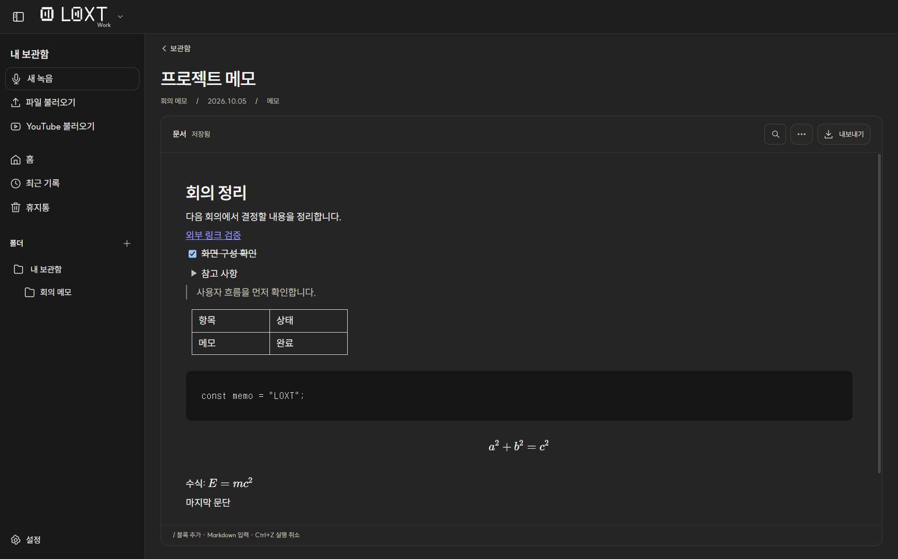
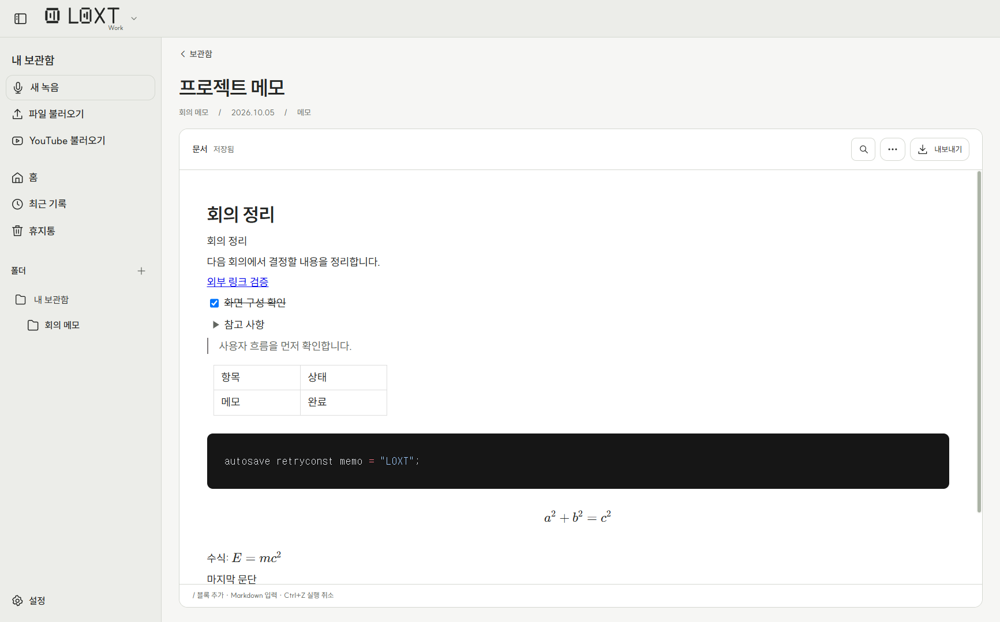
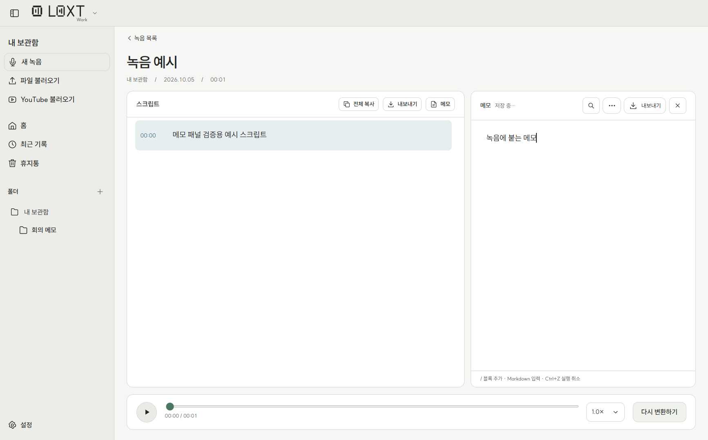
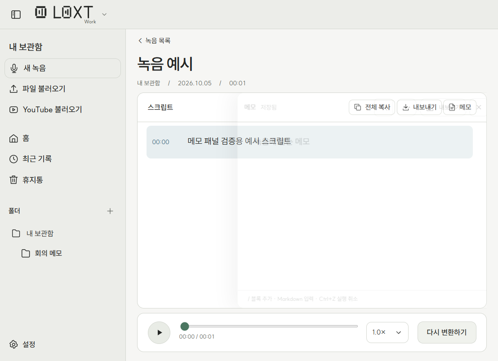

# LOXT 1.13.0 Work 메모 검증

검증일: 2026-10-05. 승인된 Work 메모 범위를 구현했다. 별도 테스트 프로필과 예시 문서만 사용했으며 사용자 녹음·스크립트·폴더·모델은 수정하거나 삭제하지 않았다. GitHub 업로드나 소개 사이트 배포는 수행하지 않았다.

## 구현

- 녹음 상세의 내보내기 오른쪽 메모 버튼으로 패널을 열고 닫는다. 스크립트·메모는 독립 스크롤이며 재생바는 유지한다. 좁은 창에서는 오른쪽 패널이 겹쳐 열린다. 닫힌 패널은 포인터 입력과 키보드 포커스를 차단하지 않는다.
- Work 홈·보관함의 새로 추가하기에서 독립 메모를 만든다. 현재 폴더, 인라인 제목 편집, 카드·작은 카드·목록·최근 기록, 우클릭·이동·선택·휴지통의 기존 기록 구조를 사용한다. Live에는 메모 생성 기능을 추가하지 않았다.
- BlockNote 기반 Markdown 입력·검색 가능한 슬래시 메뉴·선택 서식 도구·블록 핸들을 제공한다. 본문·H1–H3·목록·체크·토글·인용·구분선·표·코드·블록/인라인 수식·이미지·파일을 지원한다. 코드 구문 강조와 복사, 블록 복제·삭제·유형 변경, 실행 취소/다시 실행, 문서 검색을 포함한다.
- 녹음 메모와 독립 메모 모두 별도 `memo.json`에 본문을 저장한다. 기존 스크립트 저장은 메모를 덮어쓰지 않는다. 저장 revision, 직렬 큐, 원자적 파일 교체, 이전 정상 본문 백업과 손상 원본 보존을 사용한다.
- 입력 저장은 250 ms로 묶고 긴 연속 입력은 2초 안에 체크포인트를 시도한다. 닫기·페이지 이동·내보내기·앱 정상 종료 시 남은 입력을 저장한다. 실패 시 문서를 메모리에 유지하고 돌아가기·재시도 안내를 제공한다. 저장을 못 마친 문서의 삭제와 정상 종료를 막는다.
- 첨부파일은 UUID 경로의 로컬 파일이며 프로토콜이 실제 사용자 경로를 노출하지 않는다. 파일 저장과 웹 링크 열기는 검증한 Electron IPC를 사용한다. 코드 복사도 브라우저 권한에 의존하지 않는다.
- Markdown/HTML/PDF를 내보낸다. HTML/PDF는 SUIT 및 래스터 이미지를 포함하고 PDF의 접힌 토글은 펼쳐 출력한다. Markdown/HTML의 다른 첨부파일은 옆 `.assets` 폴더에 저장한다. HTML은 실행 가능한 태그·주소를 제거한다.
- 편집기는 메모를 열 때 지연 로드한다. SUIT와 기존 다크·라이트 테마를 사용한다. BlockNote MPL-2.0 및 편집기 의존성 라이선스 고지를 설치 파일에 포함한다.

## 검증 결과

| 검사 | 결과와 범위 |
|---|---|
| `npm run test:release` | **66/66 통과**. 기존 61개와 메모 5개. 폴더 이름 변경·폴더 삭제·복구·영구 삭제·인덱스 손실 복구·재변환 보존·오래된 저장 거절·실제 쓰기 실패·손상 본문 백업·첨부 경로·HTML 보안 검사 |
| `npm run test:memos` | 별도 프로필의 실제 Electron 소스 앱에서 통과. 생성·제목 편집·Markdown 규칙·실제 이미지/파일 업로드·이미지 렌더링·첨부 저장·블록 복제/유형 변경·코드 강조/복사·링크 도구·검색·자동 저장·실패 후 이동/재시도·다크/라이트·내보내기·녹음 메모 패널·좁은 창·종료 직전 입력 저장 |
| `scripts/improvements-ui-smoke.mjs` | 기존 흐름 통과. Work 합성 입력 녹음·일시정지/재개·중단 후 재개·버리기, 모드/설정 이동, 작은 창, 오디오 스트림/AudioContext 정리, 카드 스크롤/키보드, 폴더 드래그, Live 폴더/내보내기·빠른 제목 저장·오류 복구 |
| PDF | 실제 Electron `printToPDF` 출력. Poppler로 페이지 이미지를 만들고 한글·체크 목록·토글 내부 내용·표·코드·블록/인라인 수식을 시각 확인. PDF 텍스트의 한글 제목·본문도 검사 |
| 배포 의존성 | `npm audit --omit=dev`: 알려진 취약점 **0개**. BlockNote 0.55.0, Mantine 8.3.11, sanitize-html 2.18.0 고정 |

소스 앱 결과는 `test-results/memos-1.13.0/source.json`, `ui.log`, 회귀 결과는 `regression.log`, `recording-regression.log`, 내보낸 문서와 캡처는 같은 디렉터리에 있다. 외부 링크 검사는 OS 브라우저를 실제로 열지 않도록 `shell.openExternal`을 대체하고 URL 전달을 확인했다. 내보내기는 네이티브 저장 경로 선택만 대체했으며 실제 파일·PDF 생성 코드는 실행했다. 저장 실패는 테스트 프로필의 `memo.json.tmp` 위치에 디렉터리를 만들어 실제 파일 오류를 유발했다.

## 실제 앱 화면

아래 문서는 소개·검증용 예시다. 녹음 예시는 1초 무음 WAV에 예시 스크립트를 넣었으며 실제 GPU 변환 성공의 증거가 아니다.

## 제한과 확인하지 못한 범위

- 이번 메모 검증에서 물리 마이크·출력 장치 변경·실제 NVIDIA GPU 추론을 다시 실행하지 않았다. 기존 엔진 코드는 변경하지 않았다. 녹음 회귀는 Chromium의 가짜 오디오 입력을 사용했다.
- 모든 Windows 배율·한글 IME 조합·스크린리더·수천 블록 성능을 실측한 것은 아니다. 일반 창 1400×900과 작은 창 900×680에서 실제 화면 및 가로 넘침을 확인했다.
- 프로세스 강제 종료나 정전 직전의 미저장 입력은 보장하지 않는다. 실패한 입력은 앱 메모리에서 재시도할 수 있지만 강제 종료 뒤에는 마지막 정상 본문/백업을 사용한다.
- Markdown은 색상·밑줄·토글 등 일부 서식을 단순화한다. HTML/PDF는 안전한 정적 표현이며 원본 JSON과 완전히 동일하지 않다. PDF에 첨부파일 원본을 삽입하지 않는다. 외부 이미지 주소는 허용하지 않으며 로컬 업로드를 사용한다.
- 문서당 본문 5 MB·블록 10,000개·중첩 32단계, 첨부파일당 32 MB로 제한한다. 다른 문서에서 붙여 넣은 첨부파일 참조는 내보내기 전에 해당 문서에 다시 첨부해야 한다.
- 편집기 청크 약 1.4 MB 때문에 Vite 크기 경고가 있다. 메모 화면에서만 불러오며 임의로 경고 기준을 높이지 않았다. 모델 로딩·추론 성능 개선을 주장하지 않는다.
- 데이터베이스·협업·자동화·AI·목차·템플릿·다단 레이아웃·백링크·문서 버전 이력은 이번 구현 범위에 포함하지 않는다.

## Windows 패키지

- `release/stage5/LOXT-Setup-1.13.0-x64.exe`: **168,860,258 bytes** (약 161 MiB).
- SHA-256: `af14e495bfea35d1e4e42c88ef799638d662b2523140c678142b4220d607de57`.
- `npm run package:installer` 통과. 패키지의 Electron·shared·Python·renderer 파일과 최종 소스/빌드를 바이트 단위로 비교하는 release-manifest 검사 통과. `release.json`과 `SHA256SUMS.txt`를 생성했다.
- 패키징된 `win-unpacked/LOXT.exe`에서 `scripts/memo-ui-smoke.mjs`도 **통과**했다. 소스 앱과 동일하게 실제 업로드·파일 저장·코드 복사·외부 링크 URL 전달·검색·저장 실패/재시도·정상 종료 직전 입력 보존·Markdown/HTML/PDF 생성을 검사했다. 결과는 `test-results/memos-1.13.0/packaged.json`, `packaged.log`.
- 설치 파일 자체를 사용자 프로필에 설치하거나 기존 설치를 덮어쓰지 않았다. 새 Windows 계정에서 최초 설치·업데이트·복구·삭제의 전체 상호작용은 별도 배포 전 확인 항목이다. 기존 NSIS 흐름은 변경하지 않았다.
- 코드 서명 인증서는 없으며 manifest의 `signed`는 `false`다. 편집기 패키지 추가로 이전 버전보다 설치 파일이 커졌다.

## README와 소개 사이트 후속 반영

- README의 1.13.0 기능·다운로드 주소·저장 구조·메모 검사 명령·현재 앱 홈/메모 캡처를 반영했다.
- 소개 사이트에 녹음 메모 패널, 독립 문서, Markdown 블록 편집, 저장 실패 재시도, 첨부 제한과 내보내기 FAQ를 추가했다. 기존 SUIT·차콜 디자인을 유지했다.
- 새 설치 실행본에서 별도 예시 프로필로 **20개 화면**을 다시 촬영했다. 예시 문서와 스크립트는 소개용이며 Live 추론 성능 자료가 아니다. 촬영 기록은 `landing/public/assets/screenshots.json`.
- `node landing/scripts/release.mjs` 전체 실행 통과. 버전 동기화·앱 캡처·README 홈 이미지·사이트 빌드·390/768/1440px 화면·이미지·메모 FAQ·테마 전환·1.13.0 링크 검사·ZIP 생성. 결과: `test-results/memos-1.13.0/site-release.log`, `test-results/site-release-1.13.0.json`.
- 완성본은 `landing/dist`와 `landing/loxt-site-v1.13.0.zip`. ZIP 최상위의 index.html/assets는 Cloudflare Production 직접 업로드용이다.
- GitHub 공개 API의 `releases/tags/v1.13.0` 조회는 준비 당시 HTTP 404였다. URL 구성은 완료했으나 릴리스/설치 파일의 공개 게시를 확인한 것은 아니다. 외부 push·릴리스 게시·Cloudflare 배포는 실행하지 않았다.
- 향후 승인된 구현의 마무리 범위는 루트 `AGENTS.md`와 `docs/RELEASE-WORKFLOW.md`에 기록했다.
